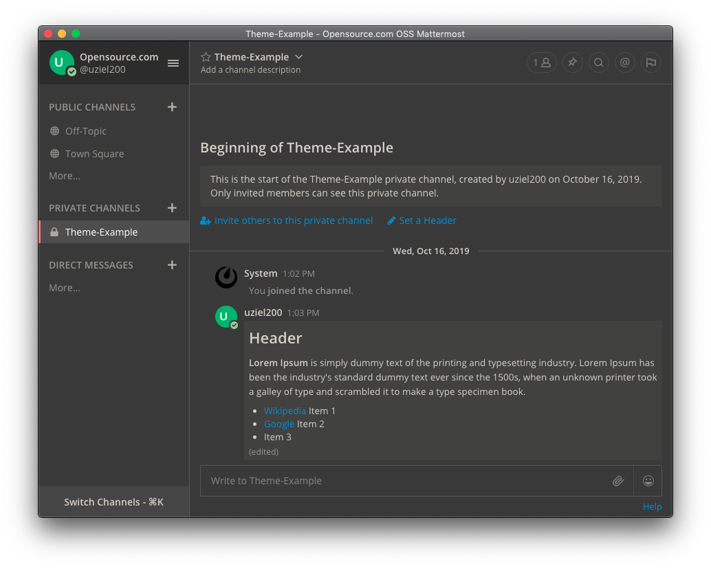

# mtm-dark-theme
Mattermost dark theme



```
{
	"sidebarBg": "#393939",
	"sidebarText": "#d3d0c8",
	"sidebarUnreadText": "#d3d0c8",
	"sidebarTextHoverBg": "#515151",
	"sidebarTextActiveBorder": "#f2777a",
	"sidebarTextActiveColor": "#ffffff",
	"sidebarHeaderBg": "#2d2d2d",
	"sidebarHeaderTextColor": "#d3d0c8",
	"onlineIndicator": "#99cc99",
	"awayIndicator": "#e0b333",
	"dndIndicator": "#f74343",
	"mentionBj": "#ffffff",
	"mentionColor": "#ffffff",
	"centerChannelBg": "#393939",
	"centerChannelColor": "#d3d0c8",
	"newMessageSeparator": "#f80",
	"linkColor": "#2389d7",
	"buttonBg": "#26a970",
	"buttonColor": "#ffffff",
	"errorTextColor": "#aa220d",
	"mentionHighlightBg": "#204b64",
	"mentionHighlightLink": "#2f81b7",
	"codeTheme": "monokai",
	"mentionBg": "#66CCCC"
}
```
